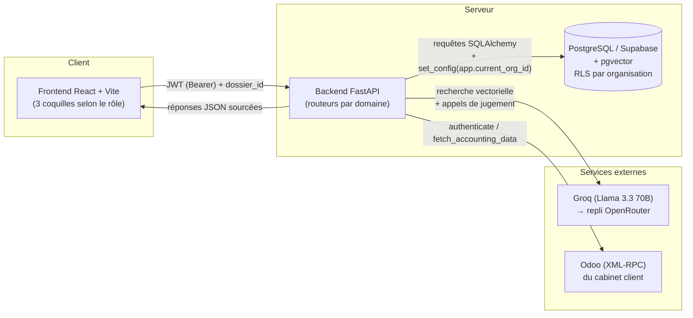

# Chapitre III : Mise en œuvre et réalisation

> Document vivant : mis à jour au fil des sessions (nouvelles sections,
> captures d'écran intégrées, reformulations). Registre rapport académique —
> contrairement à `docs/PROJET_DOCUMENTATION.md` (support de révision
> orale, lecture ligne par ligne), ce chapitre reste en prose continue,
> avec schémas et tableaux de synthèse.

> **Note de portée, pour l'assemblage final du rapport.** Ce fichier couvre
> **uniquement le Chapitre III**. Les Chapitres I (contexte, organisme
> d'accueil, problématique, cahier des charges, planning) et II (étude de
> l'existant, benchmarking, UML) vivent dans le rapport de conception déjà
> rédigé séparément — à assembler avant ce chapitre, pas à reconstruire ici.
> Les schémas ci-dessous sont fournis en **Mermaid** (texte source d'un
> diagramme, pas une image) : n'importe quel outil qui rend du Mermaid (dont
> claude.ai) peut les convertir en vrai schéma pour le document final. Les
> captures d'écran de l'application réelle ne sont **pas** incluses (aucun
> outil de cette session n'a accès à l'interface qui tourne en local) — la
> liste complète, avec les prompts `@browser` prêts à copier, est
> récapitulée en fin de chapitre.

## Introduction

Le chapitre précédent a posé l'architecture cible de Nisab : un modèle de
données multi-tenant isolant strictement les cabinets comptables les uns
des autres, un pipeline de retrieval augmenté par génération (RAG) pour
garantir qu'aucune réponse de l'assistant IA n'est affirmée sans citation
vérifiable, et une répartition en quatre rôles applicatifs reflétant les
quatre profils d'utilisateurs identifiés lors de l'analyse des besoins. Ce
chapitre présente la concrétisation technique de cette architecture : les
choix d'environnement de développement, la structuration effective de la
base de données, puis, module par module, l'implémentation des
fonctionnalités qui composent l'application.

---

## I. Environnement de développement

### 1. Backend : Python – FastAPI

Le backend de Nisab est développé en Python avec le framework **FastAPI**,
complété par **SQLAlchemy** comme ORM (Object-Relational Mapping) et
**Alembic** pour la gestion des migrations de schéma de base de données.

Ce choix répond à plusieurs contraintes du projet. D'abord, FastAPI génère
automatiquement une validation de schéma stricte via Pydantic (chaque route
déclare son contrat d'entrée/sortie sous forme de classes Python typées),
ce qui réduit une classe entière d'erreurs de validation manuelle. Ensuite,
sa nature asynchrone native s'accorde avec le profil d'usage de
l'application : des appels sortants vers des services tiers (le fournisseur
de modèle de langage, le connecteur Odoo) qui passent le plus clair de leur
temps à attendre une réponse réseau plutôt qu'à consommer du CPU. Enfin,
FastAPI génère automatiquement une documentation interactive (Swagger UI,
accessible sur `/docs`), ce qui a accéléré les tests manuels de chaque
endpoint pendant le développement, en l'absence d'une suite de tests
automatisés à ce stade du projet.

SQLAlchemy a été retenu plutôt qu'un accès SQL brut pour deux raisons :
la portabilité du code métier (les modèles Python restent lisibles
indépendamment du dialecte SQL sous-jacent) et l'intégration native avec
Alembic, qui permet de faire évoluer le schéma de base de données de
façon versionnée et réversible au fil des phases du projet — un choix
particulièrement pertinent pour un développement itératif où le schéma de
données s'est enrichi progressivement (ajout du statut d'invitation, des
colonnes de suivi d'alerte, du type d'organisation interne, etc.).

### 2. Base de données : PostgreSQL (Supabase) + pgvector

La base de données applicative repose sur **PostgreSQL**, hébergé via
**Supabase**. Ce choix a été déterminé par un besoin technique précis :
Nisab a besoin, dans la même instance de base de données, (1) d'un modèle
relationnel classique pour les données métier (organisations, utilisateurs,
dossiers clients, alertes de risque) et (2) d'une capacité de recherche
vectorielle pour interroger le corpus fiscal par similarité sémantique.
L'extension **pgvector**, disponible nativement sur Postgres, permet de
répondre aux deux besoins avec un seul moteur de base de données plutôt que
de faire cohabiter une base relationnelle et une base vectorielle dédiée
(Pinecone, Weaviate, etc.), ce qui aurait ajouté une dépendance
opérationnelle et une complexité de synchronisation entre deux systèmes
pour un projet en développement solo à échéance de deux mois.

Second bénéfice déterminant : PostgreSQL propose un mécanisme natif de
sécurité au niveau ligne, **Row-Level Security (RLS)**, décrit en détail à
la section II.1, qui a structuré l'ensemble du choix d'architecture
multi-tenant du projet.

### 3. Frontend : React & CSS

L'interface utilisateur est développée en **React 19**, avec **Vite**
comme outil de build et de serveur de développement. Le projet n'utilise
pas de framework CSS utilitaire (Tailwind ou équivalent) : les styles sont
écrits en CSS classique, organisés par fichier de composant. Ce choix
reflète la taille de l'équipe (développement solo) : l'ajout d'un framework
CSS supplémentaire n'apportait pas de gain suffisant pour justifier la
courbe d'apprentissage et la configuration additionnelle, sur une interface
dont le nombre de composants reste maîtrisable manuellement. La seule
dépendance UI externe du projet est `lucide-react`, une bibliothèque
d'icônes SVG légère.

Point notable : le projet n'utilise pas de bibliothèque de routage
(`react-router` ou équivalent). Le routage entre les différentes vues de
l'application est géré manuellement via l'état React (`useState`) combiné
à `localStorage` pour la persistance du choix de vue entre les sessions.
Ce choix est justifié en détail à la section II.2.

### 4. Environnement de travail

Le développement a été mené sous **Visual Studio Code**.

---

## II. Réalisation

### 0. Vue d'ensemble de l'architecture technique

Avant de détailler chaque module, la figure suivante situe les composants
techniques les uns par rapport aux autres : l'interface React communique
exclusivement avec l'API FastAPI, qui est le seul composant à dialoguer
avec la base de données PostgreSQL/pgvector, avec les fournisseurs de
modèle de langage (Groq, en primaire, avec repli sur OpenRouter), et avec
l'instance Odoo du cabinet via XML-RPC.



*Figure 1 — Architecture technique globale de Nisab.*

### 1. Base de données

#### 1.1 Modèle de données multi-tenant

Nisab sert des cabinets comptables qui gèrent chacun un portefeuille de
PME clientes. La contrainte de conception la plus structurante du projet
est qu'un cabinet ne doit **en aucun cas** pouvoir accéder aux données
d'un autre cabinet. Le schéma de données traduit directement cette
hiérarchie métier :

```
Organisation (type : cabinet | pme | interne)
  └── Utilisateur (rôle : collaborateur / dirigeant_pme / admin_cabinet / admin_plateforme)
  └── Dossier (une PME cliente du cabinet)
        └── Acces (jonction utilisateur ↔ dossier, niveau de droit : lecture / écriture / admin)
        └── données métier : PieceComptable, AlerteRisque, Citation, SimulationControle, ...
```

*Figure 2 — voir le Modèle Conceptuel de Données (MCD) et le Modèle
Logique de Données (MLD) du Chapitre II pour le schéma entité-association
complet. Un mémo de corrections à leur apporter (écarts identifiés entre
ces diagrammes et le schéma SQLAlchemy réellement implémenté) est fourni
séparément dans `docs/CORRECTIONS_DIAGRAMMES_CONCEPTION.md`.*

Le système distingue quatre rôles applicatifs, chacun correspondant à un
profil d'utilisateur réel identifié lors de l'analyse des besoins :

| Rôle | Portée | Description |
|---|---|---|
| `admin_plateforme` | Globale, équipe Nisab | Supervision du corpus fiscal, de la veille réglementaire et des cabinets clients. Rattaché à une organisation de type `interne`, distincte des cabinets clients pour ne pas fausser les statistiques de la plateforme. |
| `admin_cabinet` | Son cabinet entier | Gère les dossiers clients et les collaborateurs de son cabinet. |
| `collaborateur` | Dossier par dossier | Accès accordé individuellement par dossier, avec un niveau de droit (lecture, écriture, administration) — un cabinet peut restreindre l'accès de ses collaborateurs à un sous-ensemble de ses clients. |
| `dirigeant_pme` | Son dossier, lecture seule | Le client final (dirigeant de la PME) consulte les résultats produits par le cabinet, sans droit de modification. |

Le type d'organisation `interne` mérite d'être signalé : il a été introduit
spécifiquement pour rattacher les comptes de l'équipe Nisab à une entité
technique, sans les confondre avec les organisations clientes de type
`cabinet`, ce qui aurait faussé les indicateurs affichés dans l'espace
d'administration de la plateforme (nombre de cabinets actifs, etc.).

#### 1.2 Isolation des données par Row-Level Security

L'isolation entre cabinets repose sur **deux mécanismes indépendants**,
appliqués simultanément — un choix de défense en profondeur plutôt que sur
un mécanisme unique :

1. **Au niveau applicatif**, chaque requête HTTP authentifiée porte un
   jeton signé (JWT, détaillé en section 2.1) qui embarque l'identifiant
   de l'organisation de l'utilisateur ainsi que son rôle. Cette
   information n'est jamais fournie par le client dans les paramètres de
   la requête — elle est systématiquement dérivée du jeton signé côté
   serveur.
2. **Au niveau de la base de données**, chaque table contenant des
   données métier est protégée par une politique de sécurité au niveau
   ligne (Row-Level Security). Concrètement :

```sql
ALTER TABLE dossier ENABLE ROW LEVEL SECURITY;

CREATE POLICY tenant_isolation ON dossier
USING (organisation_id = current_setting('app.current_org_id', true)::uuid)
WITH CHECK (organisation_id = current_setting('app.current_org_id', true)::uuid);
```

Avant chaque requête touchant des données de dossier, le backend positionne
la variable de session `app.current_org_id` à partir de l'organisation
extraite du jeton signé de l'utilisateur courant. Les tables qui ne
portent pas directement une colonne `organisation_id` (comme les pièces
comptables ou les alertes de risque, rattachées à un dossier) sont
protégées par une politique équivalente qui remonte par sous-requête
jusqu'à la table `dossier`.

L'intérêt de ce second niveau de protection, indépendant du code
applicatif, est qu'une erreur de développement dans une route (un filtre
oublié dans une requête, par exemple) ne peut à elle seule provoquer une
fuite de données entre cabinets : c'est PostgreSQL lui-même qui refuse de
retourner les lignes appartenant à une autre organisation, quelle que soit
la requête SQL générée par l'application.

Deux tables font exception à cette politique et restent protégées
uniquement au niveau applicatif : `utilisateur` et `organisation`. La
raison est structurelle — au moment de la connexion, le serveur ne dispose
que de l'adresse email fournie, et n'a pas encore déterminé à quelle
organisation appartient l'utilisateur (c'est précisément ce que
l'authentification doit établir). Une politique RLS filtrée sur
`app.current_org_id` empêcherait donc cette recherche initiale. La
protection de ces deux tables repose alors sur la garantie que les routes
d'authentification ne retournent jamais que la ligne correspondant à
l'utilisateur authentifié, et qu'aucune route métier ne les expose en
liste brute.

`[CAPTURE: rôle=admin_cabinet, vue=DevTools réseau, état=requête vers
/dossiers/{id}/dashboard/summary]` —
`@browser ouvre les DevTools sur l'onglet réseau de localhost:5173, connecte-toi
en admin_cabinet, va sur le tableau de bord, clique sur la requête vers
/dossiers/..., et capture les headers et l'URL pour montrer qu'aucun
organisation_id n'est transmis par le client.`

---

### 2. Développement de l'interface utilisateur

L'interface est structurée autour de trois « coquilles » (*shells*)
distinctes, sélectionnées au chargement de l'application en fonction du
rôle de l'utilisateur connecté : une coquille cabinet (`AppShell`, pour
`admin_cabinet` et `collaborateur`), une coquille dirigeant simplifiée
(`DirigeantShell`, lecture seule) et une coquille de supervision plateforme
(`PlatformAdminShell`, réservée à `admin_plateforme`). Ce choix — trois
arbres de composants distincts plutôt qu'une interface unique où certains
éléments seraient masqués conditionnellement selon le rôle — vise à rendre
structurellement impossible l'exposition accidentelle d'une fonctionnalité
réservée au cabinet dans l'espace du dirigeant, une garantie qu'une
condition d'affichage oubliée ne pourrait pas offrir avec la même fiabilité.

L'application ne recourt à aucune bibliothèque de routage : la vue active
est un simple état React persisté dans `localStorage`, ce qui suffit dans
la mesure où l'application ne nécessite pas de navigation par URL profonde
(pas de partage de lien direct vers une sous-vue) pour son usage actuel.

Les sous-sections suivantes détaillent chaque module fonctionnel.

#### 2.1 Authentification et gestion de session

L'authentification repose sur des jetons signés au format **JWT**
(JSON Web Token, algorithme HS256), sans état de session conservé côté
serveur. Deux jetons sont émis à la connexion : un jeton d'accès, valide
30 minutes, envoyé à chaque requête protégée, et un jeton de renouvellement,
valide 14 jours, conservé côté client et échangé contre un nouveau jeton
d'accès lorsque celui-ci expire. Ce découpage limite à 30 minutes la
fenêtre d'exposition du jeton réellement utilisé à chaque requête, tout en
évitant à l'utilisateur de se reconnecter fréquemment.

```python
def create_access_token(utilisateur_id: str, organisation_id: str, role: str) -> str:
    return _create_token(
        {"sub": utilisateur_id, "organisation_id": organisation_id, "role": role, "type": "access"},
        timedelta(minutes=ACCESS_TOKEN_EXPIRE_MINUTES),
    )
```

Les mots de passe ne sont jamais stockés ni comparés en clair : ils sont
hachés avec **bcrypt**, un algorithme volontairement lent qui intègre un
sel aléatoire, ce qui limite l'efficacité d'une attaque par force brute
hors ligne en cas de fuite de la base de données.

Côté client, le jeton d'accès est conservé exclusivement en mémoire
JavaScript (jamais dans `localStorage`), afin de limiter son exposition en
cas de faille de sécurité de type injection de script (XSS). Seul le jeton
de renouvellement, moins fréquemment utilisé, est conservé dans
`localStorage` — un compromis assumé en l'absence, à ce stade du projet,
d'un cookie `httpOnly` qui exigerait de servir le frontend et le backend
depuis le même domaine.

`[CAPTURE: rôle=aucun (page publique), vue=écran de connexion, état=formulaire vide]` —
`@browser va sur localhost:5173 et capture l'écran de connexion.`

#### 2.2 Gestion des dossiers et vue d'ensemble du cabinet

Après connexion, l'utilisateur d'un cabinet arrive sur une vue d'ensemble
présentant l'ensemble des dossiers clients du cabinet, chacun associé à un
indicateur visuel synthétique (« feu tricolore ») dérivé du dernier audit
réalisé : rouge en présence d'au moins une anomalie critique, orange pour
une anomalie mineure, vert si le dossier est conforme. Cette vue constitue
le point d'entrée par défaut de l'application, en cohérence avec l'usage
attendu d'un cabinet gérant simultanément plusieurs dossiers clients.

La création d'un nouveau dossier est réservée au rôle `admin_cabinet`,
cohérence assumée et vérifiée à la fois côté interface (le bouton de
création n'est affiché qu'à ce rôle) et côté serveur (la route de création
est protégée par une vérification de rôle explicite).

`[CAPTURE: rôle=admin_cabinet, vue=vue d'ensemble du cabinet, état=plusieurs dossiers avec feux tricolores variés]` —
`@browser connecte-toi en admin_cabinet et capture la vue d'ensemble du cabinet.`

#### 2.3 Intégration Odoo et ingestion des données comptables

L'ingestion des données comptables s'appuie sur un connecteur **XML-RPC**
vers Odoo, qui récupère les informations de la société, ses partenaires
commerciaux actifs, ainsi que les écritures comptables validées des douze
derniers mois et leurs lignes de détail. Pour permettre une démonstration
de l'application sans nécessiter d'accès à une instance Odoo réelle, trois
scénarios de données de démonstration ont été constitués (un profil
commerce conforme, un profil présentant des anomalies caractéristiques, et
un profil orienté prestations de services), chacun conçu pour illustrer
des types de risques fiscaux distincts détectables par le moteur d'audit.

À ce stade du projet, les données importées sont conservées sous la forme
d'un instantané (« snapshot ») JSON unique par dossier, réévalué à chaque
nouvelle synchronisation, plutôt que d'un modèle relationnel détaillant
chaque pièce comptable individuellement — un enrichissement du modèle de
données prévu pour une phase ultérieure du projet (réconciliation
pièce-à-pièce).

`[CAPTURE: rôle=admin_cabinet, vue=page Odoo, état=choix entre connexion réelle et scénarios de démonstration]` —
`@browser connecte-toi en admin_cabinet, va sur la page Odoo et capture les options de connexion et de données de démonstration.`

#### 2.4 Corpus fiscal et fondations du pipeline RAG

Le corpus juridique de référence distingue explicitement deux couches de
sources : le **Code Général des Impôts (CGI)**, qui constitue le texte
légal consolidé, et le **Bulletin Officiel (BO)**, qui sert de repère
temporel et de déclencheur de veille réglementaire. Ces deux couches ne
sont jamais fusionnées dans le traitement du corpus.

Les articles du corpus, après extraction depuis les documents source, sont
convertis en représentations vectorielles (« embeddings ») à l'aide du
modèle `intfloat/multilingual-e5-base`, choisi pour sa capacité à traiter
des textes en français, arabe et darija — les langues d'usage attendues des
questions posées à l'assistant. Ces vecteurs sont stockés dans PostgreSQL
via l'extension pgvector, ce qui permet une recherche par similarité
sémantique directement dans la base de données applicative.

Un travail de mesure a mis en évidence que les scores de similarité
cosinus, sur ce corpus au vocabulaire juridique fortement partagé, restent
compressés dans une plage étroite (fréquemment entre 0,81 et 0,84), y
compris pour des articles non pertinents — un effet d'anisotropie connu
sur ce type de corpus. Cette observation a conduit à une décision
d'architecture centrale, détaillée à la section suivante : la
détection de risques n'utilise jamais de seuil de similarité brut comme
critère de décision.

#### 2.5 Audit intelligent des écritures comptables

Le module d'audit constitue le cœur fonctionnel de Nisab. Pour chaque
écriture comptable importée, il applique un pipeline en trois étapes,
chacune confiée à un appel distinct au modèle de langage (Llama 3.3 70B via
Groq, avec repli automatique sur OpenRouter en cas d'indisponibilité) :

1. **Reformulation.** Le résumé brut de l'écriture (montants, noms de
   tiers, mode de règlement) est reformulé par le modèle de langage en une
   à trois requêtes de recherche courtes, chacune focalisée sur un seul
   fait fiscalement significatif (par exemple, un mode de règlement en
   espèces est traité comme un fait recherché indépendamment de la nature
   de la dépense). Cette séparation améliore sensiblement la qualité du
   retrieval : une mesure effectuée en cours de développement a montré
   qu'un article pertinent pouvait passer de la 41ᵉ position, avec une
   requête combinant plusieurs faits, à la 1ʳᵉ ou 2ᵉ position lorsque la
   requête est focalisée sur le fait concerné.
2. **Filtrage de pertinence.** Les articles candidats retrouvés par
   recherche vectorielle (quinze au maximum) sont soumis au modèle de
   langage, qui évalue pour chacun si ses conditions d'application précises
   (secteur d'activité, nature de l'opération, seuils, qualité des
   parties) correspondent réellement aux faits de la transaction — et non
   simplement s'il partage un vocabulaire fiscal général avec celle-ci.
3. **Analyse de conformité.** Seuls les articles jugés pertinents à
   l'étape précédente sont transmis, avec leur texte intégral, au modèle
   de langage pour un jugement final : anomalie, conformité, ou contexte
   insuffisant pour conclure.

Un mécanisme de garde-fou anti-hallucination protège la référence légale
citée dans chaque anomalie détectée : la référence renvoyée par le modèle
de langage est systématiquement revérifiée par rapport à l'ensemble des
articles effectivement fournis en contexte à cette étape ; si elle ne
correspond à aucun d'entre eux, elle est remplacée par la première
référence valide disponible.

```python
valid_refs = {_normalize_ref(m.reference) for m in relevant_articles}
if _normalize_ref(reference_cgi) not in valid_refs:
    reference_cgi = relevant_articles[0].reference
```

Enfin, le résultat de chaque écriture auditée relève de l'une de trois
catégories strictement distinguées : une **anomalie** avérée, une écriture
jugée **conforme**, ou un **contexte insuffisant** pour conclure — cette
dernière catégorie étant explicitement renvoyée à la vérification d'un
expert-comptable plutôt que silencieusement assimilée à une conformité,
conformément à l'exigence de traitement des zones grises du cahier des
charges. Les échecs purement techniques (limite de quota du fournisseur de
modèle de langage, réponse mal formée) sont également isolés dans une
troisième catégorie, pour ne jamais être confondus avec un jugement métier.

`[CAPTURE: rôle=admin_cabinet, vue=page Audit, état=liste d'anomalies détectées avec sévérités et sources citées]` —
`@browser connecte-toi en admin_cabinet, charge un dossier de démonstration avec anomalies (scénario "commerce" ou "services"), lance l'audit et capture la liste des anomalies avec leurs citations.`

#### 2.6 Tableau de bord

Le tableau de bord agrège, pour le dossier actif, les informations
générales de l'entreprise et une synthèse du dernier résultat d'audit. Un
mécanisme de cache, basé sur une empreinte des données comptables
importées, évite de relancer inutilement le pipeline d'audit décrit
ci-dessus lorsque les données sous-jacentes n'ont pas changé depuis la
dernière exécution — une précaution justifiée par le coût, en temps et en
quota, de chaque exécution du pipeline.

`[CAPTURE: rôle=admin_cabinet, vue=tableau de bord, état=dossier avec données chargées]` —
`@browser connecte-toi en admin_cabinet, ouvre un dossier avec données chargées et capture le tableau de bord.`

#### 2.7 Simulation de contrôle fiscal

Le module de simulation de contrôle fiscal génère, à partir des anomalies
déjà détectées et persistées par le module d'audit, un argumentaire de
défense structuré par thème ainsi qu'un plan de remédiation. Ce module ne
relance aucune nouvelle recherche documentaire : il réutilise directement
les références légales déjà associées à chaque anomalie au moment de
l'audit, ce qui garantit la cohérence entre les deux modules et évite
qu'une même situation ne se voie attribuer deux justifications légales
différentes selon le module consulté. Les anomalies sont regroupées par
thème fiscal (par classification lexicale) et triées par exposition
financière décroissante, à l'image de la démarche qu'adopterait un
inspecteur des impôts. Le rapport de simulation peut être exporté au format
PDF, généré via la bibliothèque `fpdf2`, avec un bandeau rappelant l'usage
strictement interne du document.

`[CAPTURE: rôle=admin_cabinet, vue=page Simulation, état=argumentaire généré par thème]` —
`@browser connecte-toi en admin_cabinet, va sur la page Simulation d'un dossier déjà audité, lance une simulation et capture le résultat.`

#### 2.8 Calendrier fiscal

Le calendrier fiscal recense les échéances déclaratives et de paiement
(TVA, IS, IR, CNSS, taxe professionnelle) applicables au dossier, en les
croisant lorsque c'est possible avec les données comptables importées pour
signaler une échéance déjà réglée. Ce module se distingue explicitement des
autres modules IA du projet : il n'utilise **pas** le pipeline RAG — les
dates, textes de référence et pénalités associées sont des valeurs
inscrites directement dans le code, non vérifiées automatiquement contre le
corpus fiscal versionné. Chaque échéance produite par ce module porte un
indicateur explicite (`sourced: false`) permettant à l'interface de
distinguer cette information, non tracée par le pipeline RAG, des
citations vérifiées provenant des autres modules.

`[CAPTURE: rôle=admin_cabinet, vue=page Calendrier, état=liste d'échéances avec statuts]` —
`@browser connecte-toi en admin_cabinet, va sur la page Calendrier d'un dossier et capture la liste des échéances.`

#### 2.9 Assistant conversationnel (chat copilot)

L'assistant conversationnel permet de poser des questions fiscales en
langage naturel et reçoit une réponse structurée (base légale, analyse,
recommandation, niveau de risque), systématiquement accompagnée des
articles ayant permis d'y répondre. Le mécanisme de retrieval suit le même
principe en deux temps que le module d'audit (recherche large puis
filtrage de pertinence par le modèle de langage), appliqué cette fois à la
question de l'utilisateur plutôt qu'à une écriture comptable. Chaque
réponse fournie persiste, en base de données, une citation par source
effectivement utilisée, ce qui assure une traçabilité de bout en bout et
non uniquement au moment de l'affichage.

L'assistant est disponible sous deux formes complémentaires : un composant
flottant, accessible depuis n'importe quelle vue de l'application et qui
transmet le contexte de la vue active pour des réponses contextualisées, et
une page de discussion plein écran, qui propose également un mode de
questions générales lorsqu'aucun dossier n'est sélectionné.

`[CAPTURE: rôle=admin_cabinet, vue=assistant conversationnel, état=échange avec réponse sourcée affichée]` —
`@browser connecte-toi en admin_cabinet, ouvre l'assistant, pose une question fiscale et capture la réponse avec ses sources citées.`

#### 2.10 Gestion des invitations et des collaborateurs

Un administrateur de cabinet peut inviter de nouveaux membres (collaborateur
ou dirigeant de PME) à rejoindre l'organisation, avec assignation
optionnelle à un ou plusieurs dossiers. À ce stade du projet, l'envoi
d'un courriel automatique n'est pas encore implémenté : le lien
d'invitation, à base de jeton, est directement présenté à l'administrateur
pour transmission manuelle — un compromis assumé pour la période de
développement du projet. Le rôle `dirigeant_pme`, par construction, ne peut
jamais se voir accorder qu'un accès en lecture seule, quel que soit le
choix effectué dans le formulaire d'invitation, conformément à son
positionnement de client final consultant les résultats produits par le
cabinet.

`[CAPTURE: rôle=admin_cabinet, vue=page Invitations, état=formulaire d'invitation et lien généré]` —
`@browser connecte-toi en admin_cabinet, va sur la page Invitations, crée une invitation et capture le lien généré.`

#### 2.11 Espace administrateur plateforme et espace dirigeant

Deux espaces additionnels complètent l'application. L'**espace
administrateur plateforme**, réservé à l'équipe Nisab, permet la
supervision du corpus fiscal (validation, rejet et dédoublonnage
d'articles, déclenchement du pipeline d'extraction) ainsi qu'une vue
transverse sur l'ensemble des cabinets et utilisateurs de la plateforme.
L'**espace dirigeant**, en miroir, offre une vue simplifiée et strictement
en lecture seule à destination du dirigeant de la PME cliente, centrée sur
l'indicateur de conformité par feu tricolore — complété d'un quatrième état
neutre, explicitement distinct de « conforme », signalant qu'un audit n'a
pas pu être mené à terme pour une raison technique, afin de ne jamais
laisser croire à tort qu'un dossier est en règle.

`[CAPTURE: rôle=admin_plateforme, vue=vue d'ensemble plateforme, état=liste des organisations et statistiques globales]` —
`@browser connecte-toi en admin_plateforme et capture la vue d'ensemble de la plateforme.`

`[CAPTURE: rôle=dirigeant_pme, vue=espace dirigeant, état=indicateur de conformité affiché]` —
`@browser connecte-toi en dirigeant_pme et capture l'espace dirigeant simplifié.`

---

## Conclusion

Ce chapitre a présenté la traduction technique de l'architecture définie au
chapitre précédent : un environnement de développement resserré autour de
FastAPI, PostgreSQL/pgvector et React, une base de données multi-tenant
protégée par un double mécanisme d'isolation, et un ensemble de modules
fonctionnels dont le fil conducteur reste la traçabilité systématique de
toute affirmation produite par l'intelligence artificielle. Les
limitations assumées à ce stade du projet (instantané unique des données
comptables, calendrier fiscal non couvert par le pipeline RAG, absence
d'envoi automatique de courriel) résultent d'arbitrages de priorisation
délibérés, documentés au fil du développement, et non d'oublis — elles
constituent le socle des perspectives d'évolution évoquées en conclusion
générale de ce rapport.
